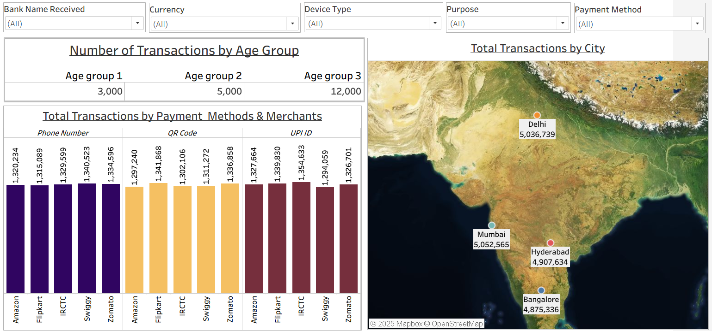

# Tableau-Digital-Payments-Dashboard 📊

This project presents an **interactive Tableau dashboard** that explores trends in India's **digital transaction ecosystem** across age groups, cities, and payment methods.

🔗 **View the interactive dashboard on Tableau Public:**  
[Click Here](https://public.tableau.com/app/profile/priyanka.kachhap/viz/SalesInsights_17567093669800/Dashboard1?publish=yes)

## 📂 Dataset
The dataset used in this project can be found here:  
[transactions.csv](data/transactions.csv)

## 🔑 Key Insights
- ✨ **Age Group 3** leads with the highest adoption → 12,000+ transactions  
- 🌆 **Delhi & Mumbai** dominate → crossing 5M+ transactions each  
- 💳 **UPI/ID payments** are catching up fast with Phone Number methods → strong shift in preference  

## 🛠 Tools & Technologies
- Tableau Public  
- Data Visualization & Analytics  

## 📸 Dashboard Preview

